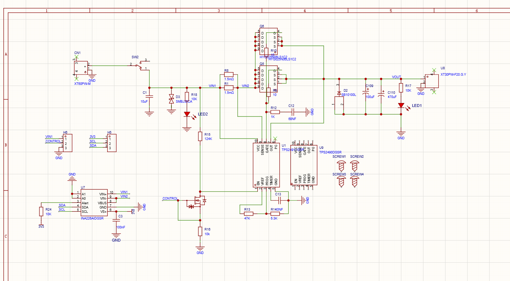
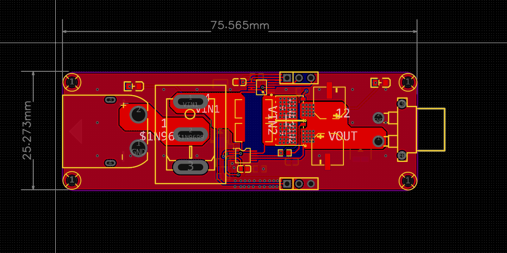
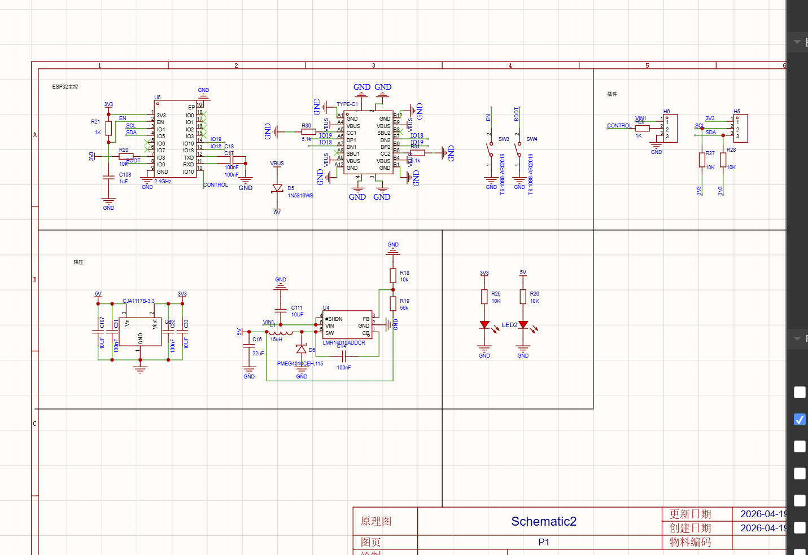
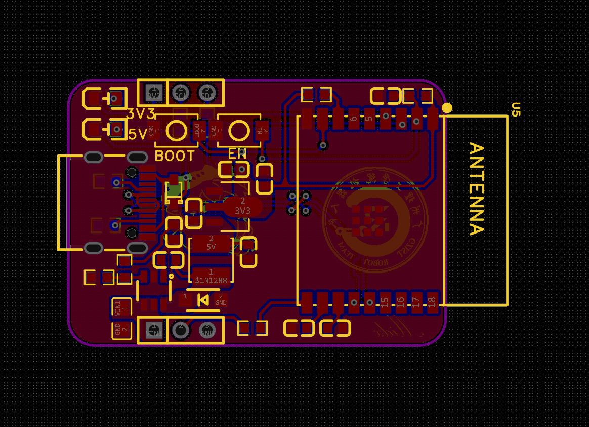

## 12. 融合设计：无线急停与智能监测

### 12.1 硬件连接要点
- **急停控制**：ESP32-C3 的 GPIOx $\rightarrow$ TPS2491 EN。利用内部上拉确保默认状态安全。

- **监测反馈**：INA226 与 ESP32 通过 I2C 互联，采样电阻建议放置在 TPS2491 的输出端。
- 
- 
- 
- 
- 
- 
### 12.2 监控
- **UI 布局**：在 Web 页面
- **数据频率**：INA226 采样频率设为 50Hz，保证热点访问时数据的实时性。
- 
### 12.3 实物
- 